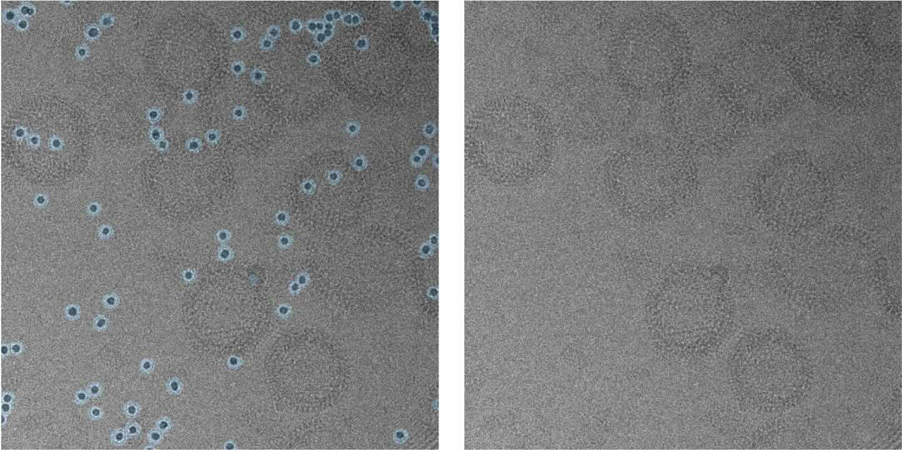

# torch-cryoeraser

[](https://github.com/teamtomo/torch-cryoeraser/raw/main/LICENSE)
[](https://pypi.org/project/torch-cryoeraser)
[](https://python.org)
[](https://github.com/teamtomo/torch-cryoeraser/actions/workflows/ci.yml)
[](https://codecov.io/gh/teamtomo/torch-cryoeraser)

*torch-cryoeraser* is a Python package for erasing local regions of cryo-EM images.


<p align="center">
  
</p>

Image data in masked regions are replaced with noise matching local image statistics.

## Installation

```python
pip install torch-cryoeraser
```

## Usage

```python
import torch
import tifffile
from torch_cryoeraser import erase_region_2d

# load image and mask
image = tifffile.imread("image.tif")
mask = tifffile.imread("mask.tif")

# to torch tensor
image = torch.tensor(image)
mask = torch.tensor(mask)

# erase masked regions
erased_image = erase_region_2d(image=image, mask=mask)
```

for more info, please check the [documentation](https://teamtomo.org/torch-cryoeraser).
